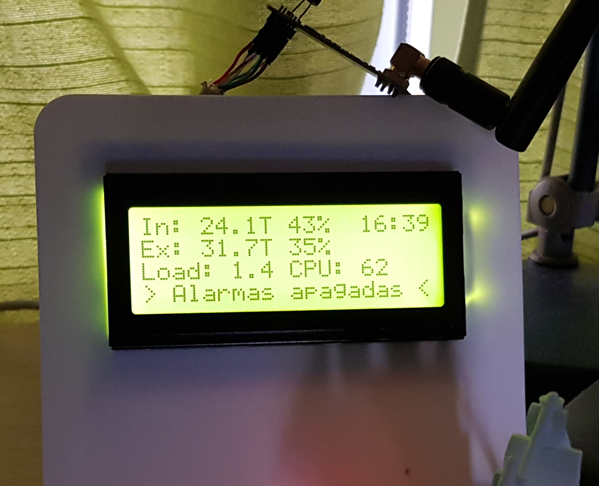
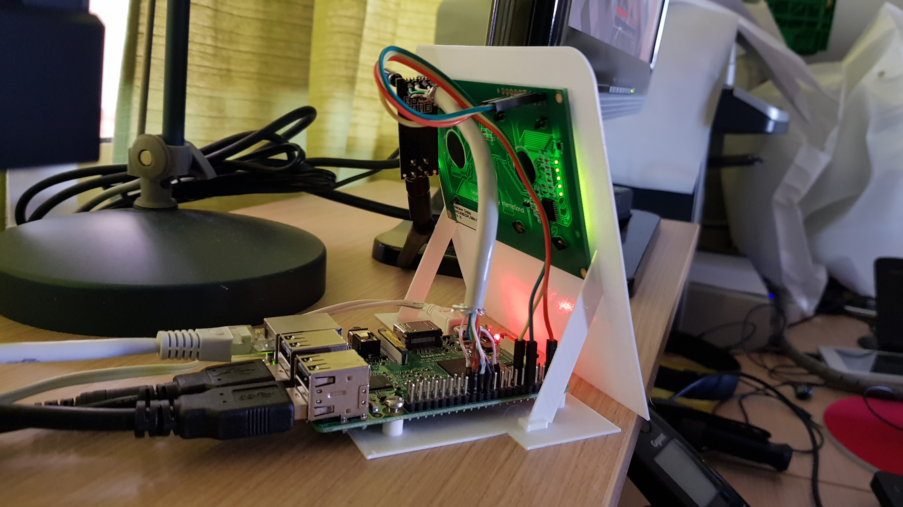
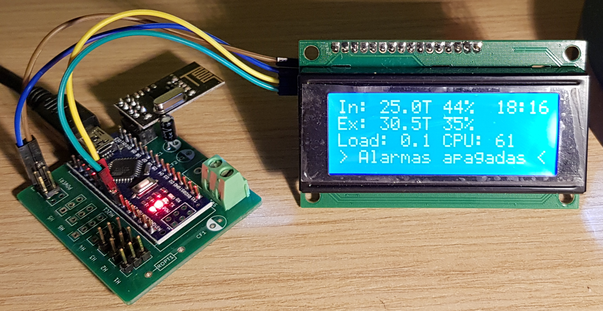

# Home Assistant Text Display

Home Assistant text-display is a custom component to allow send text to remote displays. You can send text from HomeAssistant's automations selecting the row and column for the sensors or the messages shown at the display.

This component adds some services to HomeAssitant and currently supports serial LCD-Displays and remote displays through [MySensors](https://www.mysensors.org/) network

The image is an example with a 4 rows LCD-Display showing internal/external temperature/humidity, a clock, de CPU load, CPU temperature and a alarm message. This example is explained below in this Readme



Example **configuration.yaml** using a RS232 display

```yaml
text_display:
  - platform: text_display_serial
    name: Controller Display
    serial_port: /dev/ttyS0
    baudrate: 14400
    rows: 4
    cols: 20
```

Example **configuration.yaml** using a MySensors remote display

```yaml
text_display:
  - platform: text_display_mysensors
    name: Remote display
    rows: 4
    cols: 20
    node_id: 0
    child_id: 1
```

Example of **automations.yaml** for the image shown before as example

```yaml
automation:
  # Simple clock using templates
  - alias: clock
    trigger:
        - platform: time_pattern
          seconds: 30
    action:
        - service: text_display.write_text
          entity_id: text_display.mysensors_display
          data_template:
                row: 0
                text: "CPU Load: 0.0 {{'%2.2d'|format(now().hour)}}:{{'%2.2d'|format(now().minute)}}"

        - service: text_display.write_text
          entity_id: text_display.mysensors_display
          data_template:
                text: "Line 1"
                row: 1

        - service: text_display.write_text
          entity_id: text_display.mysensors_display
          data_template:
                row: 2
                text: "Line 3"


```

## Instalation

Copy `/custom_components/*` in your HomeAssistant configuration directory `<config_dir>/custom_components`

## Detailed explanation

This component add three services to HomeAssistant: backlight, write_text and command

**Service write_text**

Sends some text to the display at row and column passed in the parameters `row` and `col`.

**Service command**

Allows send extra commands to displays using the parameter **cmd** as described in the table

| cmd        |                  |
| ---------- | ---------------- |
| clear      | Clear screen     |
| blink_on   | On cursor blink  |
| blink_off  | Off cursor blink |
| cursor_on  | On cursor        |
| cursor_off | Off cursor       |


## Configuration

The configuration in **configuration.yaml** depends of platform used. Valid platforms are **text_display_mysensors** and **text_display_serial**

Serial display configuration example

```yaml
text_display:
  - platform: text_display_serial
    name: Controller display
    rows: 4
    cols: 20
    serial_port: /dev/ttyS0
    baudrate: 14400
```

MySensors configuration example

```yaml
text_display:
  - platform: text_display_mysensors
    name: Remote display
    rows: 4
    cols: 20
    node_id: 115
    child_id: 1
```

**Configuration variables**

| Key         | Platform               | Description                                |
| ----------- | ---------------------- | ------------------------------------------ |
| rows        | all                    | Number of rows in the display              |
| cols        | all                    | Number of columns in the display           |
| name        | all                    | Custom name                                |
| serial_port | text_display_serial    | Serial port where the display is connected |
| baudrate    | text_display_serial    | Default 14440                              |
| node_id     | text_display_mysensors | MySensors node for display                 |
| child_id    | text_display_mysensors |                                            |

### Configuration example with a serial display

The example uses the display [NHD-0420D3Z](http://www.newhavendisplay.com/specs/NHD-0420D3Z-FL-GBW-V3.pdf), from [Newhaven Display International, Inc.](http://www.newhavendisplay.com/) with RS-232 (TTL) protocol. In the image it has been connected to the serial port available in a RaspberryPI where HomeAssistant is running.



**configuration.yaml**

```yaml
text_display:
  - platform: text_display_serial
    name: Display Controlador
    serial_port: /dev/ttyS0
    baudrate: 14400
    rows: 4
    cols: 20
```

This configuration is easy but I detected some issues in the serial communication.  In a long run the display data is corrupted but it can be solved adding an extra automation to clear and refresh the display. It can be seen in the following automation examples:

```yaml
automation:
    - alias: Clear display
      trigger:
        - platform: time_pattern
          hours: 6
      action:
        - service: text_display.command
          entity_id: text_display.display_controlador
          data_template:
            cmd: clear
        - service:  automation.trigger
          entity_id: automation.temperatura_display

    - alias: Temperatura display
      trigger:
        - platform: time_pattern
          seconds: 40
      action:
        - service: text_display.write_text
          entity_id: text_display.display_controlador
          data_template:
                text: "In: {{states.sensor.habitacion_trastos_119_8.state}}T {{'%2.2s'|format( states.sensor.habitacion_trastos_119_9.state)}}%  {{'%2.2d'|format(now().hour)}}:{{'%2.2d'|format(now().minute)}}"
                row: 0
        - service: text_display.write_text
          entity_id: text_display.display_controlador
          data_template:
                text: "Ex: {{states.sensor.patio_trasero_temperatura.state}}T {{'%2.2s'|format(states.sensor.patio_trasero_humedad.state)}}% "
                row: 1

        - service: text_display.write_text
          entity_id: text_display.display_controlador
          data_template:
                text: "Load: {{'%3.3s'|format(states.sensor.load_1m.state)}} CPU: {{states.sensor.patio_trasero_cpu.state|int}} "
                row: 2

```

### Configuring MySensors remote displays

To use this component as a remote display troughn MySensors network it necessary add extra layer to MySensors ` V_TEXT` messages.

This component needs a remote MySensors device with a `S_INFO` sensor type. Only a text message is supported in default MySensors implementation hence this implementation adds support for send the row and col, embedded in the `V_TEXT` message.

In  [gatewayserial.ino](arduino-mysensors/gatewayserial/gatewayserial.ino) there is an Arduino sketch with a I2C display and a function to decode in right way the `V_TEXT` messages received to be printed at row and col selected as shown in the image.



Example of **configuration.yaml**

```yaml
text_display:
  - platform: text_display_mysensors
    name: Display controlador
    rows: 4
    cols: 20
    node_id: 115
    child_id: 5
```

The `node_id` and `child_id` parameters are mandatory. Even though the HomeAssistant-MySensors integration detects `S_INFO` sensors this implementation not attach to the detected entity yet. Currently two entity are created, I'll try fix it soon.

More doc about MySensors implementation is available at [mysensors.md](doc/mysensors.md)

